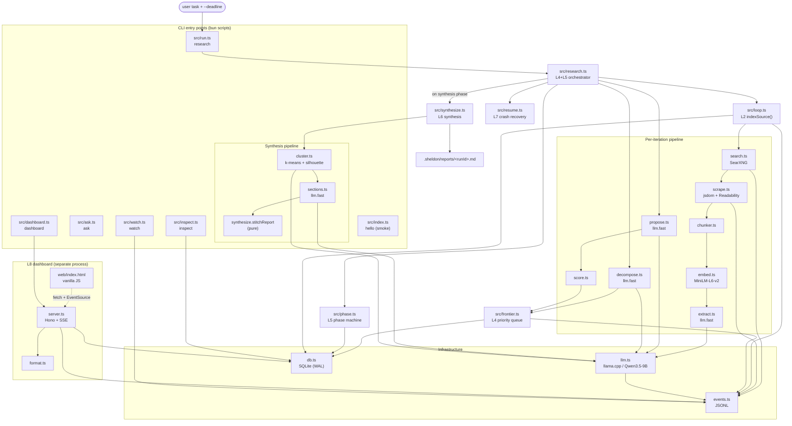
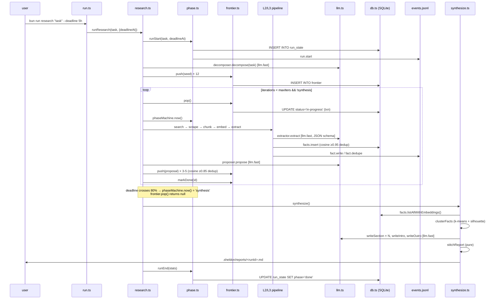
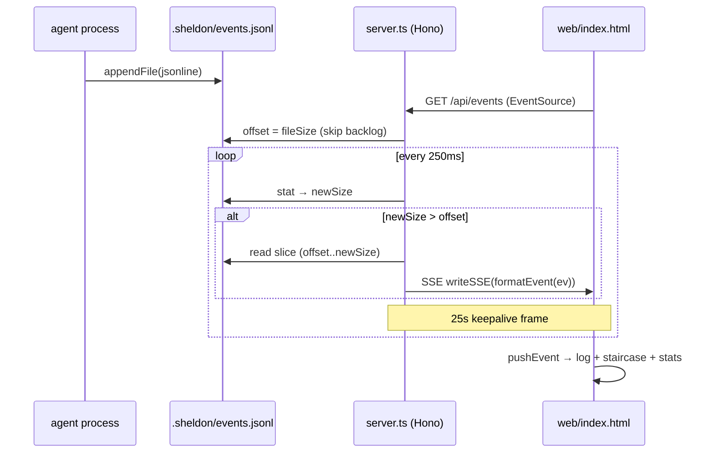
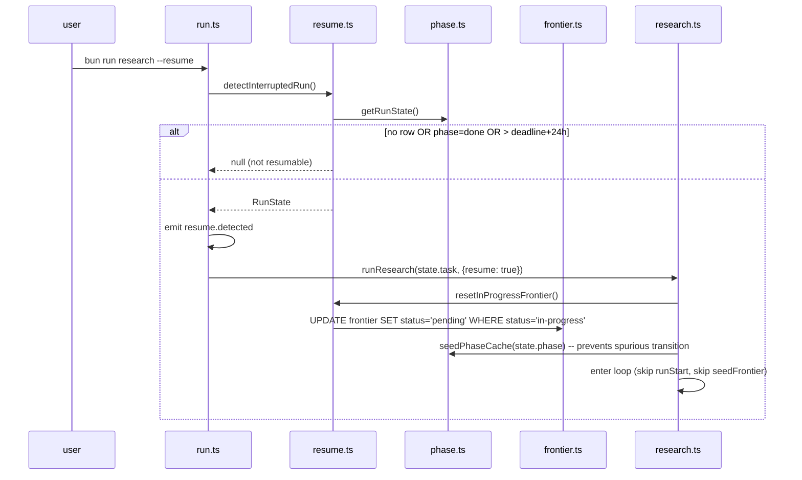

# Codebase Map

> Auto-generated by Cartographer. Last mapped: 2026-05-09.

## What is Sheldon

Sheldon is a deadline-bounded autonomous research agent written in TypeScript on Bun. The user provides a question and a wall-clock deadline; the agent researches autonomously (search → scrape → extract claims → propose follow-ups) across three timed phases, then synthesizes a cited Markdown report. All canonical state lives in SQLite (`bun:sqlite`); all observable state lives in an append-only JSONL event log. A separate Hono process serves a localhost dashboard that streams events via SSE.

Architecture is layered (L0–L8). Each layer adds one capability the next stands on, and every layer narrates itself through L1's event log.

---

## System Overview



---

## Directory Structure

```
.
├── src/                       # All TypeScript (29 files, ~39k tokens)
│   ├── index.ts               # LLM smoke test (NOT the research entry)
│   ├── run.ts                 # `research` CLI entry
│   ├── research.ts            # L4+L5 main loop orchestrator
│   ├── ask.ts                 # `ask` single-question CLI
│   ├── synth.ts               # `synthesize` CLI (thin shell)
│   ├── synthesize.ts          # L6 synthesis library + stitchReport()
│   ├── resume.ts              # L7 detection + reset + clearAll
│   ├── dashboard.ts           # `dashboard` CLI entry (binds 127.0.0.1)
│   ├── watch.ts               # `watch` CLI (events.jsonl tail)
│   ├── inspect.ts             # `inspect` CLI (facts/frontier dump)
│   │
│   ├── server.ts              # L8 Hono server + SSE stream
│   ├── format.ts              # Event → one-liner formatter
│   │
│   ├── llm.ts                 # L0 OpenAI-compat client (fast/deep)
│   ├── events.ts              # L1 append-only JSONL log
│   ├── db.ts                  # SQLite singleton + schema
│   │
│   ├── search.ts              # L2 SearXNG client
│   ├── scrape.ts              # L2 fetch + Readability
│   ├── loop.ts                # L2 searchLoop + indexSource()
│   ├── chunker.ts             # L3 token-bounded chunker
│   ├── embed.ts               # L3 @xenova/transformers (MiniLM)
│   ├── extract.ts             # L3 claim extractor
│   ├── facts.ts               # L3 fact store + cosine search
│   │
│   ├── frontier.ts            # L4 priority queue
│   ├── decompose.ts           # L4 seed-question generator
│   ├── propose.ts             # L4 follow-up proposer
│   ├── score.ts               # L4 phase-aware scoring
│   ├── phase.ts               # L5 phase machine + run-state
│   │
│   ├── cluster.ts             # L6 k-means + silhouette + LLM label
│   └── sections.ts            # L6 section/intro/outro writers
│
├── web/
│   └── index.html             # L8 dashboard UI (vanilla JS, ~19k tokens)
│
├── docs/layers/               # Design notes per layer (L1–L8)
│   ├── README.md
│   └── L1-event-log.md … L8-dashboard.md
│
├── openspec/specs/            # Canonical specs (22 specs)
├── openspec/changes/archive/  # 9 archived OpenSpec changes (foundation → dashboard)
├── .claude/                   # OpenSpec slash commands & skills
│
├── .sheldon/                  # Created at runtime (NOT in git)
│   ├── sheldon.db             # SQLite (facts, frontier, run_state)
│   ├── sheldon.db-wal         # WAL journal (during writes)
│   ├── sheldon.db-shm         # WAL shared memory
│   ├── events.jsonl           # L1 append-only log
│   ├── last-summary.md        # Output of `bun run ask`
│   └── reports/               # L6 reports (preserved across --fresh)
│       └── report-<ts>.md
│
├── AGENTS.md                  # Project-level agent instructions
├── README.md
├── package.json               # Bun scripts = CLI surface
├── tsconfig.json              # noEmit; tsc only for typecheck
└── .env.example               # 4 required env vars
```

---

## The 8 Layers

The architecture is intentionally additive — each layer is independently runnable.

| Layer | Capability | Spec dir | Modules |
|---|---|---|---|
| **L0** | OpenAI-compat LLM client (`fast`/`deep`) | `llm-client/` | `src/llm.ts` |
| **L1** | Append-only event log + tail CLI | `event-log/`, `event-tail/` | `src/events.ts`, `src/watch.ts`, `src/format.ts` |
| **L2** | Single-shot search → scrape → summarize | `search-loop/`, `searxng-client/`, `web-scraper/` | `src/loop.ts`, `src/search.ts`, `src/scrape.ts` |
| **L3** | Persistent fact store with embeddings | `chunker/`, `embedder/`, `claim-extractor/`, `fact-store/` | `src/chunker.ts`, `src/embed.ts`, `src/extract.ts`, `src/facts.ts`, `src/db.ts`, `src/inspect.ts` |
| **L4** | Self-directed exploration (frontier queue) | `frontier-queue/`, `scorer/`, `question-decomposer/`, `followup-proposer/` | `src/frontier.ts`, `src/score.ts`, `src/decompose.ts`, `src/propose.ts`, `src/research.ts`, `src/ask.ts` |
| **L5** | Wall-clock deadline + 3-phase machine | `phase-machine/`, `run-state/` | `src/phase.ts`, `src/run.ts` |
| **L6** | Cluster + write + stitch report | `cluster-facts/`, `section-writer/`, `report-stitcher/` | `src/cluster.ts`, `src/sections.ts`, `src/synth.ts`, `src/synthesize.ts` |
| **L7** | Crash recovery & resume | `resume/` | `src/resume.ts` |
| **L8** | Live localhost dashboard (optional) | `dashboard-server/`, `dashboard-ui/` | `src/server.ts`, `src/dashboard.ts`, `web/index.html`, `src/format.ts` |

Layer narratives live at `docs/layers/L*.md`; behavioral contracts live at `openspec/specs/*/spec.md`.

---

## Module Guide

### CLI surface (package.json)

There is no `sheldon` binary — every command is `bun run <script>`.

| Command | Entry | Purpose |
|---|---|---|
| `bun run research "<task>" --deadline 5h` | `src/run.ts` | Main autonomous research run |
| `bun run research --resume` | `src/run.ts` | Resume an interrupted run |
| `bun run research --fresh "<task>" --deadline 5h` | `src/run.ts` | Wipe `.sheldon/` (preserves `reports/`) and run |
| `bun run research --kill-after <dur>` | `src/run.ts` | Debug crash sim — `process.exit(137)` |
| `bun run ask "<question>"` | `src/ask.ts` | Single L2 search-loop answer → `.sheldon/last-summary.md` |
| `bun run synthesize` | `src/synth.ts` | Standalone L6 synthesis from current facts |
| `bun run dashboard [--port 4000]` | `src/dashboard.ts` | Hono server on `127.0.0.1` |
| `bun run watch [--kind ...] [--layer ...] [--since 5m]` | `src/watch.ts` | Polling tail of `events.jsonl` (200ms, ANSI color) |
| `bun run inspect [--frontier] [--limit N] [--topic X]` | `src/inspect.ts` | SQLite dump of facts or frontier |
| `bun run hello` | `src/index.ts` | LLM smoke test (despite the filename, NOT the agent entry) |
| `bun run typecheck` | — | `tsc --noEmit` |

### L0 — LLM client

**`src/llm.ts`** — OpenAI-compatible HTTP client wrapping `${LLM_BASE_URL}/v1/chat/completions`. Lazy singleton (`llm.fast(...)` / `llm.deep(...)`). Toggles llama.cpp's Qwen3 thinking via `chat_template_kwargs.enable_thinking`. Custom `User-Agent: Mozilla/5.0` to bypass Cloudflare. Every call (success or failure) emits one `llm.fast`/`llm.deep` event before throwing or returning.

> **Reality check:** `llm.deep()` is implemented but *not used at runtime*. Qwen3.5-9B in thinking mode burned its full output budget on `reasoning_content` and returned 0 content tokens during synthesis. Section/intro/outro writers all use `llm.fast`. AGENTS.md and `docs/layers/L6-synthesis.md` document this.

### L1 — Event log

**`src/events.ts`** — `events.emit({kind, layer, durationMs?, payload?})` appends one JSON line to `.sheldon/events.jsonl`. Non-throwing on I/O errors (logs to stderr). The `EventKind` union is closed at the type level (27 kinds: `llm.fast`, `search.query`, `scrape.fetch`, `fact.write`, `fact.dedupe`, `frontier.push`, `frontier.dedupe`, `frontier.pop`, `phase.transition`, `iteration.start`, `cluster.computed`, `section.written`, `report.written`, `resume.detected`, `resume.applied`, etc.). Misspellings are compile errors.

**`src/watch.ts`** — Polls `events.jsonl` at 200ms with byte-offset tracking (deliberately not `fs.watch` — flaky on macOS for append-only files). Filters: `--kind llm.*` (glob), `--layer L0,L2`, `--since 5m`. Emits color-coded ANSI lines.

**`src/format.ts`** — Pure function `formatEvent(ev) → string`. Used by both `watch.ts` and the dashboard SSE stream — single source of truth for "how is event X displayed?"

### L2 — Search loop

**`src/search.ts`** — `searxngClient.query(text, opts?)` → `{title, url, snippet}[]`. Hits `${SEARXNG_BASE_URL}/search?format=json`. Default 10s timeout via `AbortController`. No rerank/dedup here ("L3's job"). Defensively reads `content` OR `snippet` (SearXNG returns whichever).

**`src/scrape.ts`** — `scraper.fetch(url, timeoutMs=15000)` → `ScrapeOk | null`. Plain `fetch()` + `jsdom` + Mozilla Readability. **Never throws** — all error paths return `null` and emit `scrape.skip`. JS-rendered pages do not work (no headless browser). Hard cap **24,000 chars** (`MAX_TEXT_CHARS`); silently truncates with `truncated: true`. Rejects non-`text/html` content types.

**`src/loop.ts`** — Two exports:
- `indexSource(source, question, questionId?)` — chunk → embed → extract → insert. Reused verbatim by L4. Per-source try/catch; one bad scrape never aborts the loop. `rawExcerpt` is capped at 800 chars.
- `searchLoop.answer(question)` — L2 single-shot wrapper: search → scrape (top 3) → indexSource each → `llm.fast` summary → write `.sheldon/last-summary.md`.

`TOP_N = 3` is hardcoded in both `loop.ts` and `research.ts`.

### L3 — Fact store

**`src/chunker.ts`** — `chunkText(text, {maxTokens=400, overlapTokens=80})`. Three-tier split: paragraph → sentence → hard token-cut. Tokenizes through `embedder.tokenize()` so chunks align with the embedding vocabulary. 80-token sliding overlap. Sentence regex is heuristic — splits on `[.!?]` followed by uppercase/digit/quote, doesn't handle "Dr. Smith".

**`src/embed.ts`** — `embedder.embed(texts) → Float32Array[]` (each 384-dim, mean-pooled, L2-normalized). Uses `Xenova/all-MiniLM-L6-v2` in-process via `@xenova/transformers` — no Python. `EMBED_DIM = 384` is hardcoded; `unpackEmbeddings` strides assuming `[batch, 384]`. Lazy single load; first call downloads the model from HuggingFace. Batched at `MAX_BATCH = 32`.

**`src/extract.ts`** — `extractor.extract(chunk, {question, sourceUrl, sourceTitle?}) → Claim[]`. `llm.fast` with `response_format: json_schema`, `maxTokens: 1024`. Prompt cap: ≤12 claims per chunk. Confidence clamped to `[0, 1]`. **Retries once** on malformed JSON (strips markdown fences as fallback). Returns `[]` on persistent failure — never throws.

**`src/facts.ts`** — Persistent store backed by `facts` table.
- `insert(input)` → `number | null` — null means deduped (cosine **≥ 0.95** against any existing embedding).
- `findSimilar(emb, {topK=10, minSim=0.5}) → SimilarFact[]` — full-table scan; brute-force cosine.
- `list({limit=50, sourceUrl, topicTag})` — no embeddings returned.
- `listAllWithEmbeddings()` — used by L6 clustering.
- Embeddings stored as raw little-endian Float32 BLOB; `bufToFloatArr` uses `DataView` for unaligned offsets.

> **Performance ceiling:** O(n) on every insert and every similarity search. Adequate for hundreds to low thousands of facts. No ANN index. `sqlite-vec` would be needed past ~10k facts.

**`src/db.ts`** — Singleton SQLite handle. Schema (created idempotently on first `getDb()`):
```sql
facts(id, claim, source_url, source_title, raw_excerpt, embedding BLOB,
      topic_tag, confidence, question_id, created_at)
  + idx_facts_source(source_url), idx_facts_topic(topic_tag)

frontier(id, question, score, status, parent_id, depth, embedding,
         created_at, processed_at)
  + idx_frontier_status_score(status, score DESC)

run_state(id CHECK(id=1), task, started_at, deadline_at, phase)  -- singleton
```
WAL mode (`PRAGMA journal_mode=WAL`), foreign keys on. `resetDb()` closes + nulls the handle so the next call re-opens fresh — used by `server.ts` to survive `SQLITE_IOERR_VNODE` after `--fresh` deletes the file.

**`src/inspect.ts`** — CLI dump. Default fact dump has no row limit; `--frontier` sorts pending → in-progress → done → skipped, score desc within pending.

### L4 — Frontier queue

**`src/frontier.ts`** — Priority queue ordered `score DESC, id ASC`.
- `push(input)` → `number | null` (null = deduped). Cosine **≥ 0.85** against ALL existing rows (any status), not just pending. Caller must pass an L2-normalized embedding — module does NOT renormalize.
- `pop()` — atomic `pending → in-progress` in a SQLite transaction. **Returns `null` during synthesis phase** (consults `phaseMachine.now()`). This is how L5 locks search off.
- `markDone(id, outcome)`, `markSkipped(id, reason)`.
- `allEmbeddings()` is full-table; `research.ts` calls it twice per proposal batch (no caching).

**`src/score.ts`** — Pure functions, no I/O.

| Phase | Formula |
|---|---|
| `breadth` | `0.4·r + 0.5·n + 0.1·(0.7^d)` — novelty-dominant |
| `depth` | `0.5·r + 0.15·n + 0.35·min(1.5, 1+0.05·d)` — relevance-dominant |
| `synthesis` | `0` (search locked) |

`computeNovelty(candidate, existing[])` = `1 - max(cosine)`. Returns `1` if no existing.

**`src/decompose.ts`** — `decomposer.decompose(task, {count=12})` → `Seed[]` (`{question, topicTag, score}`). `llm.fast` + JSON schema, retry-once. Score clamped to `[0.5, 0.9]` — guaranteed non-zero, sub-max. The system prompt has a `{count}` placeholder string-replaced before the call.

**`src/propose.ts`** — `proposer.propose({originalTask, parentQuestion, recentClaims, pendingTitles})` → `Followup[]` (`{question, relevance, why}`). `llm.fast` + JSON schema, retry-once, returns `[]` on failure. Bounds: ≤10 claims (200 chars each), ≤5 pending titles (120 chars). Caller (`research.ts`) passes up to 8 claims via `RECENT_CLAIMS_FOR_PROPOSER`.

**`src/research.ts`** — Main L4+L5 orchestrator. `runResearch(task, opts)` → `ResearchSummary`.
- Calls `runStart()` → `seedFrontier()` (decompose → embed → push) → `while !synthesis && iter < maxIters: pop → processIteration → markDone/Skipped`.
- `processIteration`: search → scrape → indexSource each → propose → score+push.
- **Six `isSynthesis()` checkpoints** in a single iteration (after search, after scrape, around each indexed source, before propose) so the synthesis transition halts work promptly.
- Synthesis is triggered after the loop ends if `currentPhase()==='synthesis' && factsAddedTotal > 0`. **Synthesis errors are caught and logged but do not fail the run.**
- Resume path skips `runStart` and `seedFrontier`, calls `resetInProgressFrontier()` and `seedPhaseCache(restorePhase)`.

**`src/ask.ts`** — Thin wrapper over `searchLoop.answer`.

### L5 — Phase machine

**`src/phase.ts`**
- `parseDeadline(input, now)` accepts duration strings (`5h`, `90m`, `500ms`) and ISO-8601 absolutes; rejects deadlines ≤ `MIN_DEADLINE_MS` (60s) in the future.
- `runStart(task, deadlineAt)` writes the singleton `run_state` row and emits `run.start`.
- `runEnd(stats)` flips `phase='done'` and emits `run.end`.
- `phaseMachine.now()` — pure clock computation: `breadth` 0–30%, `depth` 30–80%, `synthesis` 80–100%. Single in-memory cache `lastSeenPhase` ensures one `phase.transition` event per boundary (synthesizes events for any boundaries skipped during a long iteration). DB write of new phase is best-effort (try/catch, telemetry only).
- `seedPhaseCache(phase)` — used on resume to prevent a spurious initial transition.

**`src/run.ts`** — Manual `argv` parsing (no `commander`/`yargs`). Default `maxIters=10` if no deadline. `--kill-after` calls `setTimeout` + `process.exit(137)` for resume testing. Refuses to start if an interrupted run is detected without `--resume` or `--fresh`.

### L6 — Synthesis

**`src/cluster.ts`** — `clusterFacts(facts, opts?) → Cluster[]`. K-means++ initialization. Sweeps `k ∈ [5,10]`, picks best mean silhouette score. Deterministic with Mulberry32 PRNG (`seed=42`). Two-tier labeling: dominant `topicTag` if >50% members share one, else `llm.fast` over the first 3 claims (200 chars each). Drops clusters with <5 members. Small-N path: if `facts.length < max(30, kMin*minSize)` → single cluster. Empty-cluster re-seed uses `Math.random()` (intentional escape hatch).

**`src/sections.ts`** — Three writers, all `llm.fast`:
- `writeSection({label, facts}, {originalTask})` — 200–500 words, citations as `[N]` matching `localId`. `maxTokens: 2500`, up to 2 attempts. `filterCitations` strips any `[N]` outside `validIds` (hallucination guard).
- `writeIntro(task, sectionLabels, runStats)` — 80–150 words, no citations. `maxTokens: 800`.
- `writeOutro(task, sectionLabels, runStats)` — 60–120 words, no citations. `maxTokens: 600`.

> **Why fast not deep:** the file header comments `llm.deep` was intended, but the inline note explains the deliberate switch — Qwen3.5-9B in thinking mode returns 0 content tokens at this prompt size.

**`src/synthesize.ts`** — Library module. `synthesize() → SynthesizeResult | null`.
1. `factStore.listAllWithEmbeddings()`
2. `clusterFacts()` (single fallback cluster if empty)
3. For each cluster: trim to `MAX_FACTS_PER_SECTION = 12` nearest-to-centroid → `writeSection`
4. `writeIntro`, `writeOutro`
5. `stitchReport(...)` — **pure function** that renumbers section-local `[N]` → globally-unique `[M]` in URL first-appearance order, collapsing duplicate URLs to one global index.
6. Write `.sheldon/reports/<runId>.md` (versions to `-v2.md`, `-v3.md` if collision); update `latest.md`.

**`src/synth.ts`** — 31-line CLI. The names are intentionally swapped: `synth.ts` is the thin shell, `synthesize.ts` is the library.

### L7 — Resume

**`src/resume.ts`**
- `detectInterruptedRun()` returns the row iff `phase != 'done'` AND `Date.now() < deadline_at + RESUME_GRACE_MS` (24h).
- `resetInProgressFrontier()` runs `UPDATE frontier SET status='pending' WHERE status='in-progress'`.
- `clearAll()` deletes `sheldon.db{,-wal,-shm}`, `events.jsonl`, `last-summary.md` — **preserves `.sheldon/reports/`**.

### L8 — Dashboard

**`src/server.ts`** — Hono app. `createApp() → Hono`. Routes:

| Route | Purpose |
|---|---|
| `GET /health` | Liveness |
| `GET /` | Serves `web/index.html` (read on every request — dev hot-reload) |
| `GET /api/run-state` | Phase, task, deadline, counts |
| `GET /api/frontier` | All frontier rows + per-question fact count |
| `GET /api/facts?limit=N` | Recent facts (1–100, default 20) |
| `GET /api/stats` | Aggregated counts + 30-bucket sparklines (reads ALL of `events.jsonl` per call) |
| `GET /api/events` | SSE stream |

SSE (`/api/events`):
- Starts at current EOF — new connections only see live events (no backlog replay).
- 250ms poll, 25s keepalive frames, file-shrink detection (rotation/delete → reset offset).
- Each line is `formatEvent(ev)` → `{ts, kind, layer, durationMs?, summary, error?}`.
- Every non-SSE `/api/*` call invokes `resetDb()` first to survive `SQLITE_IOERR_VNODE` from the writer's `--fresh` recreating the DB file.

**`src/dashboard.ts`** — `127.0.0.1` only, default port 4000, `idleTimeout: 0` (keeps SSE alive), graceful `SIGINT`.

**`web/index.html`** — Single page, vanilla JS, no framework, no bundler. Pure CSS phase visibility (`body[data-phase="..."]`). Polls run-state/frontier every 2s, facts/stats every 5s. Live `EventSource` to `/api/events`. 80-line capped log with hover-to-pause. Synthesis overlay is currently a placeholder ("clusters forming…") — awaits `/api/sections` per code comment. Loads `Inter` + `JetBrains Mono` from Google Fonts (browser internet required).

---

## Data Flow

### A research run, end to end



### Dashboard SSE stream



### Crash recovery



---

## Conventions

**Layer tags in events.** Every `events.emit()` call sets `layer: 'L0'..'L8'`. The watch CLI and dashboard filter on it. Adding a new module? Pick the layer that owns its concern.

**Closed `EventKind` union.** New event kinds require editing `src/events.ts`. Misspellings are compile errors. Don't paper over with `as any`.

**Non-throwing degradation pattern.** Several modules return `null`/`[]` instead of throwing for *expected* failure modes:
- `scraper.fetch` → `null` on non-HTML / Readability failure / network
- `extractor.extract` → `[]` on persistent malformed JSON
- `decomposer.decompose` → `[]` on persistent malformed JSON
- `proposer.propose` → `[]` on persistent malformed JSON
- `events.emit` → console.error on I/O failure
- `factStore.insert` → `null` on near-duplicate

Keep this contract — the loop must not die on a single bad scrape or a flaky LLM call.

**SQLite is canonical, JSONL is narration.** All durable state lives in `.sheldon/sheldon.db`. The event log is a tail-friendly side-channel; deleting it is safe. Resume reads from SQLite, not from `events.jsonl`.

**Embedding L2-normalization is the caller's job.** `frontier.push`, `score.computeNovelty`, and `factStore.insert` all assume cosine = dot product. The embedder produces normalized vectors; if you ever introduce a different source, normalize before passing in.

**JSON-schema responses + retry-once + markdown-fence stripping.** Every LLM call expecting structured output uses `response_format: json_schema`, retries once on parse failure, and tolerates ```json fences as a defensive fallback. Replicate this pattern when adding new structured calls — don't invent a different one.

**Phase-aware checkpoints.** Long iterations check `isSynthesis()` at multiple points so the agent doesn't keep working past the deadline. New stages inside `processIteration` should add a checkpoint.

**Fast over deep at runtime.** Despite specs and comments mentioning `llm.deep` for synthesis-grade work, every runtime caller uses `llm.fast`. Treat the deep mode as currently broken for production use until the model swap (see `docs/layers/L6-synthesis.md`). Don't switch existing callers to `deep` without re-validating.

**Phase, citations, and report numbering are pure functions.** `phaseMachine.now()`, `score()`, and `stitchReport()` have no I/O. Keep them that way — it's how the synthesis report stays deterministic and the phase recovers correctly after a crash.

---

## Gotchas

- **`src/index.ts` is NOT the agent entry.** It's an LLM smoke test (`17 * 23`). The research entry is `src/run.ts`, mapped via `package.json` script `research`.
- **`synth.ts` vs `synthesize.ts` is intentionally swapped.** `synth.ts` is the 31-line CLI shell; `synthesize.ts` is the library exporting `synthesize()` and `stitchReport()`.
- **Hardcoded thresholds, in code not config.** `TOP_N=3`, `DEDUPE_THRESHOLD=0.95` (facts) / `0.85` (frontier), `MAX_TEXT_CHARS=24000`, `MAX_FACTS_PER_SECTION=12`, `EMBED_DIM=384`, `BREADTH_END=0.30`, `DEPTH_END=0.80`, `MIN_DEADLINE_MS=60000`. Search the file before changing — they're not in a single config module.
- **Default `--max-iters` is 10.** Without `--deadline`, `runResearch` defaults `deadlineAt` to `now + 24h`, which keeps the run in `breadth` for the entire iteration cap and never triggers synthesis.
- **`/api/stats` reads the entire `events.jsonl` into memory on every call.** Cheap early, slow later in a long run.
- **`facts.findSimilar` and `factStore.insert` are O(n) full scans.** No vector index. Past a few thousand facts this becomes the bottleneck.
- **Embeddings download on first run.** `@xenova/transformers` fetches `Xenova/all-MiniLM-L6-v2` from HuggingFace on the first `embedder.embed`/`tokenize` call — cold-start latency is real.
- **Sentence splitter is heuristic.** "Dr. Smith said…" will split incorrectly. Tolerable for chunking but worth knowing.
- **`fs.watch` is avoided on purpose.** `watch.ts` polls every 200ms because `fs.watch` is flaky on macOS for append-only files.
- **DB file path is relative to CWD.** `.sheldon/sheldon.db` is hardcoded. Always run agent and dashboard from the repo root, otherwise they look at different `.sheldon/` directories.
- **Dashboard server reset-on-each-request.** Calls `resetDb()` before every non-SSE `/api/*` handler with one retry on `SQLITE_IOERR_VNODE` — required because `--fresh` deletes the DB file out from under it.
- **SSE shows live events only.** No backlog replay. Browsers connecting mid-run won't see prior events; for that, use `bun run watch`.
- **Cosine similarity is dot product.** All similarity code skips the `||a||·||b||` denominator and assumes inputs are L2-normalized.
- **Qwen3.5-9B + thinking mode = empty content.** `llm.deep` consumes its full output budget on `reasoning_content`. Use `llm.fast` for synthesis until model is swapped.
- **`@xenova/transformers` is dynamically imported in `embed.ts`** — don't replace it with a static `import` without testing Bun cold-start.

---

## Navigation Guide

**To add a new CLI subcommand:** add an entry under `package.json` `scripts`, then create `src/<name>.ts` doing top-level `await`. No CLI framework — read `Bun.argv` directly.

**To add a new event kind:** edit the `EventKind` union in `src/events.ts`, then add a case to the `switch` in `src/format.ts` so it gets a friendly summary in the watch CLI and dashboard.

**To change the priority formula:** `src/score.ts` — pure functions, no DB. Update the corresponding test assertions in `openspec/specs/scorer/spec.md` if behavior changes.

**To tune dedup thresholds:** frontier in `src/frontier.ts` (`DEDUPE_THRESHOLD`); facts in `src/facts.ts` (`DEDUPE_THRESHOLD`). They're per-file constants.

**To touch phase boundaries:** `src/phase.ts` — `BREADTH_END`, `DEPTH_END`. Phase is a pure function of elapsed time; no schedulers to update.

**To add a synthesis section type:** the section/intro/outro writers all live in `src/sections.ts`. The orchestration is `synthesize()` in `src/synthesize.ts`. Section bodies use local `[1..N]` citations; `stitchReport` renumbers them globally — don't try to make sections globally-aware.

**To add a dashboard endpoint:** `src/server.ts` — `app.get('/api/whatever', ...)`. Remember to call `resetDb()` if reading SQLite. The UI lives in `web/index.html` — vanilla JS, polled fetch or `EventSource`.

**To add a new LLM call:** import `llm` from `./llm.ts`. For structured output, use `responseFormat: { type: 'json_schema', ... }` and the retry-once + fence-strip parser pattern from `extract.ts` / `propose.ts` / `decompose.ts`. Set `maxTokens` explicitly — the default is 2048.

**To add a new SQLite table:** add the `CREATE TABLE IF NOT EXISTS` in `src/db.ts`. There's no migration system — for a personal tool, the convention is to bump the schema and use `bun run research --fresh`.

**To debug a stuck run:**
1. `bun run watch --since 5m` — look for the last `iteration.start` and what kind happened next.
2. `bun run inspect --frontier` — see queue state.
3. `bun run dashboard` — visual.

**To resume after crash:** `bun run research --resume`. Within 24h of the deadline. To start over: `bun run research --fresh "<task>" --deadline 5h`.

---

## Required Environment

| Var | Required | Where used |
|---|---|---|
| `LLM_BASE_URL` | yes | `src/llm.ts` (`/v1/chat/completions`) |
| `LLM_API_KEY` | yes | `src/llm.ts` (Bearer) |
| `LLM_MODEL` | yes | `src/llm.ts` (request body) |
| `SEARXNG_BASE_URL` | yes | `src/search.ts` |

External services: a self-hosted SearXNG, an OpenAI-compatible LLM endpoint (the project targets llama.cpp running Qwen3.5-9B at `ai.mayoq.tech`). Browser internet for Google Fonts when using the dashboard.

---

If cartographer helped you, consider starring: https://github.com/kingbootoshi/cartographer - please!
